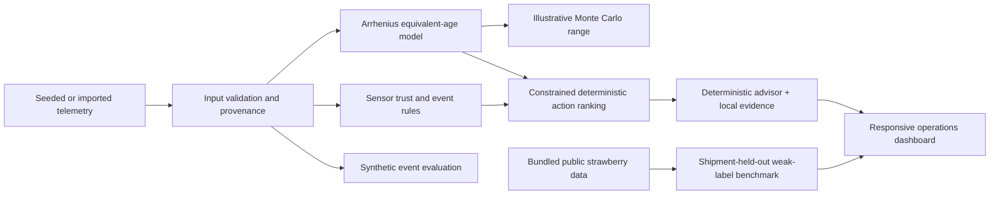

# ColdChain Guardian

**ColdChain Guardian estimates a product quality-age proxy and remaining shelf life under configured demonstration assumptions. It does not independently certify that food is safe for consumption.**

Cold-chain operators need more context than a fixed-temperature alarm provides. This app turns a shipment's temperature history into an illustrative quality-age estimate, sensor-trust signals, a grouped incident timeline, and a ranked set of constrained actions. A deterministic Qatar/GCC simulator demonstrates the workflow, and a separate Field data view explores five cited public datasets. Observed source data and simulated Qatar/GCC scenarios are labeled separately throughout the app.

## What is implemented

- A responsive operations dashboard with Overview, Shipments, Field data, Simulation Lab, Evaluation Lab, Product Models, and Evidence views.
- Six seeded, deterministic synthetic shipments covering a healthy route, hot handoff, door excursion, sensor drift, sensor dropout, and cooling failure.
- Arrhenius equivalent-age physics with current RSL, Quality Debt, and an illustrative Monte Carlo range over kinetic parameters and sensor noise.
- Static-expiry, threshold, degree-hour, and physics-only simulator baselines. Product ML-only and physics-plus-ML residual predictions remain inactive until measured product outcomes are supplied.
- Heuristic multi-sensor health checks and coalesced excursion events. Sensor faults remain separate from product degradation.
- Deterministic action ranking. Inventory or surplus redirection stays blocked unless an authorised safety clearance exists; the app does not produce one.
- A local Markdown evidence retriever and deterministic advisor. An optional OpenAI-compatible endpoint has response-shape, fixed-action, human-review, and basic unsupported-claim checks; rejected responses fall back offline.
- A synthetic what-if comparison for normal routing and expediting. QAR values and costs are labelled `DEMO_INPUT`.
- A JSON telemetry ingestion API and upload control. Imported observations stay in server memory and retain `groundTruthType: UNKNOWN` unless a separate source establishes otherwise.
- A synthetic event evaluation command that writes metrics, fold summaries, predictions, and detected events to `artifacts/evaluation/`.
- A reproducible 24-trace synthetic demo pack with injected-event truth and detector outputs, downloadable from Evaluation Lab; every record is explicitly synthetic.
- A Field data view with observed strawberry shipment traces plus a compact browser library for all five public-data sources. It includes sample air/surface traces from mango, milk, and apple datasets, separate measured lab/fruit values where supplied, and untimestamped retail case summaries.
- A leave-one-shipment-out benchmark that compares a small learned early-warning classifier with a transparent temperature rule. Its target is the source release's rule-derived severe temperature state in the next 120 minutes, not measured spoilage.

The workspace includes adapters and locally downloaded measured data for a mango air-cargo route, a Spanish bulk-milk tank, six US strawberry shipments, a commercial German apple cold room, and retail produce cases. The Field data page now exposes bounded samples from those sources, generated from the Pydantic adapters and served read-only by the local app. Mango physical-quality measurements and milk laboratory measurements are shown as separate records; neither is silently joined to a plotted temperature series or used to calibrate the Node app's RSL model. No source provides pathogen clearance, validated Qatar procedures, customer operations data, or Qatar/GCC food-shipment outcomes. Product kinetics in the dashboard remain illustrative demo inputs; measured RSL error, calibrated spoilage probabilities, calibrated intervals, food-loss savings, and Qatar route performance are unavailable.

## Sustainability and SDG alignment

The intended direct contribution is to UN Sustainable Development Goal 12, Target 12.3, which includes reducing food losses along supply chains. The app also describes possible co-benefits for Goal 2 (food availability) and Goal 13 (climate action if avoidable food loss falls). These are goals the product is designed to support, not measured project outcomes: the prototype has no validated tonnes saved, food-access result, or emissions assessment. See the official [Goal 12](https://sdgs.un.org/goals/goal12), [Goal 2](https://sdgs.un.org/goals/goal2), and [Goal 13](https://sdgs.un.org/goals/goal13) pages.

## Architecture



The service uses Node.js built-in modules only. The browser UI uses plain HTML, CSS, SVG, and JavaScript. The server and demo do not need npm packages, databases, hosted APIs, or internet access.

## Start the app

Requirements: Node.js 20 or later.

From this folder, run:

```powershell
node server.mjs
```

Open [http://127.0.0.1:4173](http://127.0.0.1:4173). To use another port:

```powershell
$env:PORT = '5000'
node server.mjs
```

The dashboard starts with the six seeded scenarios. Press **Simulation Lab** to inject an event and compare an intervention. The results show modeled extra aging by route stage and a lower-side p10 arrival margin; both are based on illustrative demo assumptions. Press **Run synthetic event check** in Evaluation Lab to exercise the event detector. These outcomes are simulation checks, not field validation. In Evaluation Lab, download the 24-trace synthetic pack for an offline walkthrough or data-shape example. Regenerate it with `node scripts/generate_synthetic_demo_pack.mjs`; its known event labels are generator inputs, not measured quality outcomes or independent validation.

Open **Field data** to explore observed strawberry shipment temperatures and choose from five cited datasets. The compact library shows bounded, adapter-generated sample traces for mango, milk, and apples, source summaries for retail display cases, and independent sample counts for measured quality values. Lab/fruit measurements stay separate from sensor traces unless a defensible data join has been documented. In Evaluation Lab, **Run public benchmark** trains and evaluates the weak-label early-warning classifier across six complete shipment holdouts. That classifier predicts the source release's future R2 temperature-state label only; it does not predict spoilage or shelf life.

## Data preparation and telemetry import

### Real-world adapter suite

Five provenance-preserving Python adapters standardize the downloaded sources into the Pydantic `SensorObservation` contract in `coldchain/data/schema.py`. Measured product endpoints use a separate `QualityMeasurement` record so laboratory values are not silently duplicated across sensor rows.

```powershell
python -m pip install -r requirements-data.txt
python scripts/download_open_datasets.py
python scripts/verify_data_adapters.py
python scripts/export_sensor_observations.py mango artifacts/mango-sample.jsonl --limit 1000
python scripts/generate_field_data_samples.py
```

The Field data browser bundle can be refreshed with `python scripts/generate_field_data_samples.py` (requires the Python data dependencies and local dataset downloads). It streams the source adapters and writes a compact `public/field-data-samples.json`; it does not place all 2.2 million sensor records in the browser. The UI's **Download compact sample** link retrieves that display bundle, not a complete raw-data export.

The complete verification streams 2,247,512 validated sensor records and 7,714 quality measurements across the five sources. See [docs/DATA_CARD.md](docs/DATA_CARD.md) for ranking, source-specific limits, leakage controls, and licensing. The mango dataset is restricted to noncommercial use under its repository terms, so commercial training requires permission or a replacement source.

The **Field data** view shows observed temperatures for each of the six bundled US strawberry shipments, source row counts, and the percentage of eligible rows with a positive future R2 label. It also lets a user inspect bounded samples from the four other datasets. Those sources have different roles: the mango and milk physical/lab measurements are separate from displayed sensor history; apple data supply temperature/humidity histories but no quality outcome; retail data are untimestamped case aggregates. Strawberry future targets are author-derived weak labels, not laboratory quality measurements. The 4°C line is only the comparison rule used by the strawberry benchmark; it is not a strawberry or food-safety limit. See [data/public-strawberry/NOTICE.md](data/public-strawberry/NOTICE.md), the [strawberry dataset release](https://huggingface.co/datasets/NifferLi/Cold-Chain-Transportation-Strawberry), and [docs/DATA_CARD.md](docs/DATA_CARD.md). Do not treat the research report's example scores as app measurements.

The app accepts JSON observations shaped like [data/example-telemetry.json](data/example-telemetry.json). The supported sensor IDs are `front`, `centre`, `rear`, and `door`; temperatures must be Celsius. Timestamps are sorted, duplicate sensor readings at the same timestamp are averaged, and missing channels are retained. Uploaded rows are not automatically considered observed ground truth.

Import in the Shipments view or send JSON to `POST /api/observations/ingest`. Imported data are held in memory until the server stops. The request body limit is 4 MB and the API validates timestamps, product IDs, sensor IDs, units, and temperature bounds.

## Evaluation

Run the deterministic synthetic event check and write its outputs:

```powershell
node scripts/evaluate.mjs
```

The command creates:

- `artifacts/evaluation/metrics.json`
- `artifacts/evaluation/fold_metrics.csv`
- `artifacts/evaluation/predictions.csv`
- `artifacts/evaluation/events.csv`

Those metrics describe configured synthetic event traces only. Separately, the public-benchmark evaluator fits a simple classifier to predict the bundled dataset's derived future temperature-risk label. It uses complete shipment holdouts and raw sensor readings only. This does not train the product RSL model: measured product-quality labels are still missing, so the residual RSL model remains inactive. RSL MAE/RMSE, spoilage classification, food-quality failure lead time, and interval coverage stay blank until suitable measured labels exist.

Run the public benchmark from the Evaluation Lab or with the command below:

```powershell
node scripts/evaluate_public_strawberry.mjs
```

The Evaluation Lab displays pooled classifier F1, recall, Brier score, the 4°C-rule F1, and per-shipment F1/false-negative results. The API response also contains pooled precision and accuracy, but it does not include row-level predictions. The command writes `metrics.json`, `fold_metrics.csv`, and `predictions.csv` under `artifacts/public-benchmark/`; the prediction file contains the weak label and model outputs for audit. The benchmark target is a weak, rule-derived future temperature-state label. See [docs/EVALUATION.md](docs/EVALUATION.md) before interpreting the metrics.

## API

The server serves the documented endpoints under `/api` (the equivalent root paths also work):

| Method | Endpoint | Purpose |
|---|---|---|
| `GET` | `/api/health` | Local service status |
| `GET` | `/api/shipments` | Fleet summary and shipment list |
| `GET` | `/api/shipments/{id}` | Quality passport, readings, events, and actions |
| `POST` | `/api/observations/ingest` | Validate and ingest JSON sensor observations |
| `POST` | `/api/predict/rsl` | Calculate a physics quality state |
| `POST` | `/api/detect/anomalies` | Return grouped rule-based events and sensor trust |
| `GET` | `/api/alerts` | Fleet events |
| `POST` | `/api/simulate` | Generate a synthetic shipment scenario |
| `POST` | `/api/simulate/compare` | Compare the route with a simulated expedite action |
| `POST` | `/api/recommendations` | Rank eligible deterministic actions |
| `POST` | `/api/advisor/query` | Explain the state with local evidence |
| `GET` | `/api/evaluation/summary` | Show data readiness and baseline status |
| `POST` | `/api/evaluation/run` | Run synthetic event check and write evaluation artifacts |
| `GET` | `/api/products` and `/api/products/{id}` | Inspect product model profiles |
| `GET` | `/api/evidence` and `/api/evidence/{id}` | Inspect local evidence notes |
| `GET` | `/api/public-benchmark/summary` | Public dataset counts, eligible/positive row counts, target definition, and limits |
| `GET` | `/api/public-benchmark/shipments` | List the six source shipment groups |
| `GET` | `/api/public-benchmark/shipments/{id}` | Read a shipment's temperature rows and source-derived target metadata for display |
| `GET` | `/api/field-data/samples` | Read compact examples and provenance for the five local public-data sources |
| `POST` | `/api/public-benchmark/evaluation/run` | Run six complete-shipment holdouts; return metrics and fold summaries, without row-level predictions |

For example:

```powershell
Invoke-RestMethod http://127.0.0.1:4173/api/health
```

## Optional language model

The deterministic advisor is always available offline. To configure an OpenAI-compatible JSON endpoint, set these environment variables before starting the server:

```powershell
$env:CCG_LLM_ENDPOINT = 'https://your-provider.example/v1/chat/completions'
$env:CCG_LLM_API_KEY = 'your-key'
$env:CCG_LLM_MODEL = 'your-model'
node server.mjs
```

The optional advisor sends the structured quality state, ranked allowed actions, retrieved local evidence, and the question to the configured endpoint. These values may contain operational shipment details; configure a provider only when that data may be sent there. Its response must be valid JSON, repeat the deterministic top action, and require a human inspection. Basic phrase and number checks reject certain unsupported safety, spoilage, performance, or invented-number claims; these filters are limited and are not a safety control. Rejected or unavailable responses fall back to the offline advisor. Neither advisor can change RSL or determine food safety. Keep real keys in environment variables; `.env.example` contains names only.

## Documentation

- [Claims register](docs/CLAIMS.md)
- [Model card](docs/MODEL_CARD.md)
- [Data card](docs/DATA_CARD.md)
- [Evaluation protocol](docs/EVALUATION.md)
- [Research brief integration notes](docs/RESEARCH_BRIEF_INTEGRATION.md)
- [3–5 minute demo script](docs/DEMO_SCRIPT.md)
- [Public benchmark notice](data/public-strawberry/NOTICE.md)
- [Contribution guide](CONTRIBUTING.md)
- [Open-source license](LICENSE)
- `knowledge/` — local demo evidence, explicitly not operating procedures
- [Research and product brief](deep-research-report-2.md)

## Screenshots

Capture the Overview, Shipment Passport, Field Data, Simulation Lab, and Evaluation Lab after launching the app. Screenshots are intentionally not fabricated from mock HTML or supplied as evidence of system performance.

## Limitations

- Every seeded Qatar/GCC shipment, route, sensor reading, event, prediction, and what-if result is simulated.
- Product reference temperatures, nominal shelf lives, kinetic parameters, and cost values are `DEMO_INPUT`; they are not validated specifications.
- The Monte Carlo interval is illustrative and has no measured coverage guarantee.
- Sensor trust and event types come from heuristics, not a field-tested anomaly model.
- ML-only predictions and learned physics residuals need product-specific, grouped training data and remain inactive.
- A synthetic route evaluation does not establish accuracy on operational or laboratory data.
- Quality prediction does not detect pathogens, approve inventory, or replace current product-specific policy and human inspection.
- The bundled strawberry shipments are from the United States. The benchmark's severe-risk targets are derived from temperature-state rules and do not label measured spoilage. Six shipments are too few to establish general performance across routes, seasons, products, or countries.
- The public benchmark's leave-one-shipment-out score concerns its weak temperature-state label only; it does not validate the configured strawberry RSL estimate or product shelf life.
- The app source is MIT-licensed. The separately licensed public dataset is Apache-2.0 according to its upstream dataset card; see its attribution and full license in `data/public-strawberry/`.

See [docs/CLAIMS.md](docs/CLAIMS.md) before using the app in a presentation.
