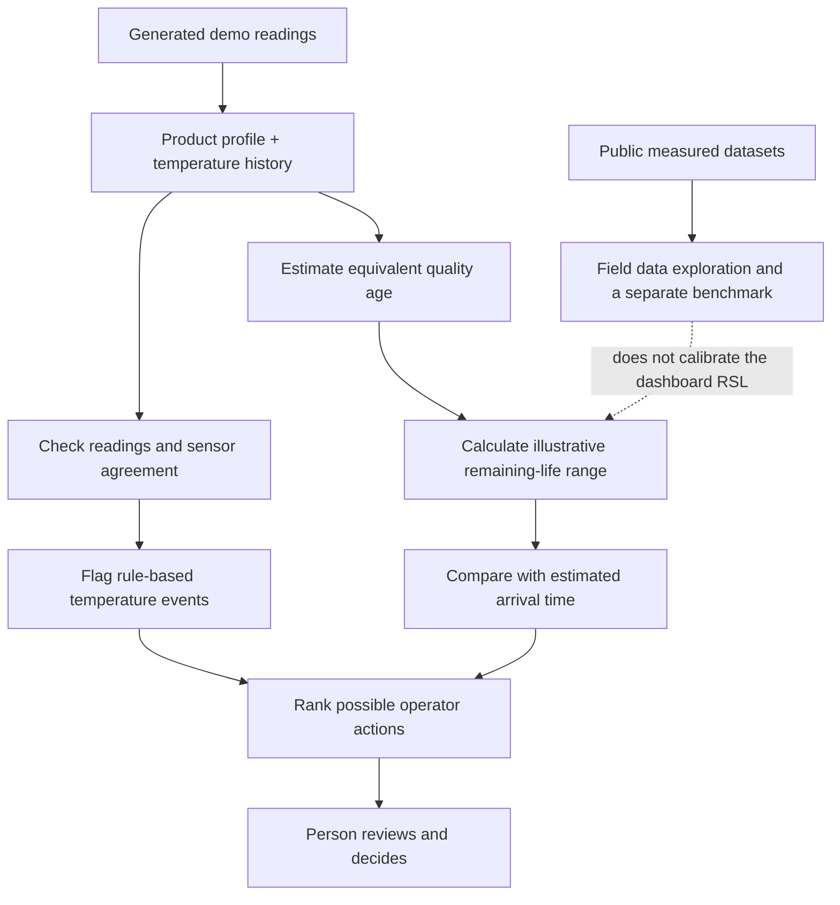

# ColdChain Guardian: teammate guide

This guide is for teammates who are new to food logistics, software, or machine learning. It explains the problem, what the app does, how to demonstrate it, what its numbers mean, and where its evidence stops.

## The idea in one minute

Fresh food travels through a chain of places: a farm or factory, a truck or plane, a port or warehouse, and finally a shop or distribution centre. Many fresh foods need to stay cool during that journey. If the cooling fails, a door stays open, or a handoff takes too long, the food may lose quality faster.

ColdChain Guardian is a decision-support prototype. It takes a product profile and a history of temperature readings, looks for unusual warming and sensor problems, estimates how much of the product's configured quality life may have been used, and shows actions a person could consider. The goal is to give an operator an earlier, clearer signal so they can inspect a shipment, restore cooling, unload it sooner, or compare a route option.

The app is designed for a Qatar/GCC use case because heat and imported food make cold handling especially relevant. The Qatar/GCC routes and shipments displayed in the demo are simulated. The app does not currently prove that it predicts real Qatar food quality or prevents food loss.

### Copy-ready pitch

> “ColdChain Guardian is a prototype that turns a shipment’s temperature history into an understandable quality-age estimate, sensor and event warnings, and a shortlist of actions for a human to review. It combines a simple temperature-response model with public-data exploration and scenario testing. The Qatar-style routes are simulated, and the current remaining-shelf-life numbers are illustrative rather than field-validated or food-safety decisions.”

## The problem, with a simple example

Imagine a box of strawberries that should stay cold on its way to a shop. A temperature sensor records the air around the box every few minutes. The box may have a short warm spell while a loading door is open, followed by a long period back in a refrigerator.

A basic alarm can say, “The temperature went over the selected limit.” That is useful, but it does not describe the whole history. A short warm spell and a long warm spell are different. ColdChain Guardian adds up the temperature history using a product profile, estimates the extra rate of quality aging, and compares the estimate with the estimated time left on the trip. It then gives the operator information to investigate.

An analogy: a car trip uses fuel faster when the driver spends time accelerating hard. The trip’s distance alone does not describe fuel use. In the same way, the hours since packing alone do not describe temperature-related quality aging. This app tries to account for the temperature history. The car analogy is only an explanation; food quality is much more complex and must be measured for each product.

## How the app works

In the current dashboard, the steps mean:

1. **Read the inputs.** A shipment has a product type, timestamps, temperature readings, and an estimated arrival time (ETA). Some records are generated by the demo; uploaded readings are marked user-supplied.
2. **Check the sensors.** The app looks for missing readings, unusually flat readings, disagreement, or a channel warming differently from its peers. These are heuristic checks, meaning hand-written rules, not a trained sensor-fault AI.
3. **Look for events.** Threshold and duration rules group warm readings into events such as a hot handoff or cooling failure. The event label is a rule-based interpretation of the trace.
4. **Estimate equivalent age.** For each time interval, the app uses the median available sensor temperature and a configured Arrhenius temperature-response calculation. Warmer conditions can count as more quality-aging time than the same clock time at the product’s reference temperature.
5. **Estimate remaining shelf life.** The configured nominal life is reduced by the equivalent age. The app also repeats the calculation 240 times while varying selected assumptions and adding illustrative noise, then reports p10, p50, and p90.
6. **Compare the estimate with the trip.** It subtracts ETA from an RSL estimate to show an arrival margin. A small or negative margin triggers a more cautious status or action ranking.
7. **Leave the decision with a person.** The ranked actions are prompts for review. The app does not release food, certify safety, or tell anyone that a product is safe to sell, donate, or eat.

The model uses product profiles for fresh strawberries and pasteurised skim milk, but their reference temperatures, nominal shelf lives, and kinetic parameters are marked `DEMO_INPUT`. They are not validated product specifications. The milk profile is not a microbial-count model.

## What the main screens are for

### 1. Overview

This is the fleet summary. It shows the seeded shipment records, their status under the demo rules, a watchlist, and a schematic Hamad Port–Doha corridor. The corridor is a visual scenario, not live GPS or evidence about an actual shipment.

Use the watchlist to choose a record and open its shipment details. Explain that a status such as **AT RISK** comes from configured heuristics and model estimates; it is not a probability that food has spoiled.

### 2. Shipments and shipment detail

The Shipments page lists each seeded record and its provenance. Open a row to view its quality passport, sensor history, detected events, estimated RSL, sensor flags, and possible actions.

The **Why did you alert?** advisor can explain a selected result using local evidence notes. It explains the existing result; it does not change the model calculation.

The **Import telemetry JSON** control accepts observations in the app’s expected JSON format. Uploaded data is marked user-supplied and its ground-truth quality status is unknown unless independently established. Uploading real readings does not by itself make the RSL estimate validated.

### 3. Field data

This page lets the team explore published, measured datasets. The library contains five different sources:

| Dataset | In everyday terms | Useful for | Important limit |
|---|---|---|---|
| Strawberry transport, United States | Temperatures at nine positions across six shipments | Comparing sensors and demonstrating shipment-level temperature patterns | Its future “R2” target is derived from temperature rules, not measured spoilage or shelf life |
| Mango air cargo, Thailand to France | Temperatures and humidity during route stages, plus later physical quality measurements | Exploring how a real route’s thermal history might relate to measured mango quality | One route; timestamps have stage-specific context; no dashboard RSL calibration |
| Bulk raw-milk tank, Spain | Tank temperatures and separate laboratory records | Dairy storage analysis and future temperature-to-lab research | Farm bulk raw milk is not pasteurised milk in distribution; lab records are not pathogen clearance |
| Commercial apple cold storage, Germany | Cold-room air and fruit-surface temperatures, humidity, and dew-point context | Sensor placement, humidity, and storage-condition analysis | No direct quality endpoint in this source |
| Retail produce cases | Summaries of temperatures and moisture at different case positions | Understanding retail display conditions | These are aggregate rows without timestamps, so they are not a time series |

The Field data page shows bounded examples rather than every raw row. Measured mango and milk quality records are displayed separately from temperature traces because a valid link between a particular reading and a quality sample has not yet been established. These sources help demonstrate the data-ingestion foundation; they are not fed into the dashboard’s RSL calculation.

### 4. Simulation Lab

This is the easiest place to demonstrate the concept. It creates a generated shipment, lets you add a handling or sensor event, and shows how the configured model responds.

Suggested walkthrough:

1. Open **Simulation Lab**.
2. Choose **Fresh strawberries** or **Pasteurised skim milk** as the product model.
3. Select **Hot handoff** as the injected event. A hot handoff means the shipment is exposed to warmer conditions during a transfer between transport or storage stages.
4. Keep the other settings at their defaults for the first run, then select **Run scenario**.
5. Read the temperature chart from left to right. The colored lines represent four generated sensor positions; the highlighted interval marks a detected excursion.
6. Read the output cards: p50 remaining quality life, Quality Debt, p10 arrival margin, and sensor trust.
7. Compare the normal route with the simulated expedite option. Point out that both future handling and the cost are assumptions.
8. If useful, select **Play over time** to watch the generated scenario progress.

Change only one setting at a time on a second run. For example, keep the product and event the same and increase event duration. That makes it easier to explain which input caused the displayed result to change. Every result in this lab is simulated, even when it resembles a real logistics event.

#### What the suggested actions mean

These are names for possible workflow steps. The app ranks them with fixed rules and demo assumptions; the ranking is not a validated business optimizer.

- **Inspect:** have an authorized person check the shipment and records.
- **Hold:** pause the next handling or release step while a person reviews the situation.
- **Prioritize unloading:** reduce waiting time at the next handoff or receiving area.
- **Adjust cooling:** check and restore the configured cooling condition.
- **Expedite:** simulate shortening the remaining travel time.
- **Reroute:** compare a different route as a scenario.
- **No action:** the configured rules found no urgent quality signal; this is not a safety clearance.
- **Redirect surplus / prioritize inventory:** these options require an authorized food-safety clearance. They are blocked while the app’s safety status is `NOT_DETERMINED`.

### 5. Evaluation Lab

There are two separate activities here. Do not combine their scores into one claim.

**Synthetic event check:** select **Run synthetic event check**. The app generates 24 traces with known injected events and checks whether its rule-based detector finds them. This checks whether the demo’s detector behaves against events the simulator created. It is not a test on real shipments.

**Public strawberry benchmark:** scroll to **Early warning on the public strawberry data** and select **Run public benchmark**. It holds out one whole shipment at a time, trains on the other five, and predicts whether a future temperature-rule label will occur within 120 minutes. This is a real-data benchmark for that narrow label. The label is not measured spoilage, food safety, or RSL, and six shipments are a small sample.

Metrics such as F1 or Brier score on this page describe agreement with the source’s rule-derived label. They do not tell us how many hours of shelf life the app predicts correctly.

### 6. Product Models

Use this page to see the configured product assumptions: reference temperature, nominal life, kinetic assumption, available sensors, stated quality endpoint, and data limits. The `DEMO_INPUT` badge matters: these are assumptions used to make a working demonstration, not values approved by a food scientist or validated against a production process.

### 7. Evidence

The local advisor can search these Markdown notes to explain why it surfaced a result. This is a small offline evidence library for the demo. The entries are explicitly not approved standard operating procedures (SOPs). The advisor explains a result; it does not change the RSL calculation or determine food safety.

## Key terms in plain language

| Term | Plain-language meaning |
|---|---|
| **Cold chain** | The connected refrigerated steps food travels through from production to storage, transport, and sale. |
| **Food loss / food waste** | Food loss usually describes food lost earlier in production and supply; food waste often describes food discarded by retailers or consumers. Exact definitions vary. This prototype has not measured reductions in either. |
| **Shipment / lot / batch** | A shipment is food being moved together; a lot or batch is a group made or handled together and identified for tracking. |
| **Telemetry** | Measurements sent or recorded automatically, such as temperature readings with times. |
| **Sensor / logger** | A device that measures a condition. A logger stores readings over time. |
| **Route stage / handoff** | A stage is one part of the journey, such as airport storage. A handoff is when responsibility or custody passes to another team or vehicle. |
| **Dwell time** | How long food waits in one place, such as on a loading dock. |
| **Temperature excursion / thermal event** | A period when temperature crosses the app’s configured threshold. It is a reason to investigate, not proof that food spoiled. |
| **Reference temperature / setpoint** | The temperature used as the model’s comparison condition. In this demo it is an illustrative product setting, not a universal legal limit. |
| **Shelf life** | The time a product is expected to retain a defined quality under stated conditions. It depends on the product and the chosen quality endpoint. |
| **Quality endpoint** | The specific measurable outcome used to define acceptable quality, such as a lab measurement or agreed rejection threshold. A model needs a clear endpoint before its prediction can be validated. |
| **Microbial / microbiological** | Related to tiny organisms such as bacteria, yeasts, or molds. This app does not currently predict a measured microbial count or detect pathogens. |
| **RSL (Remaining Shelf Life)** | The model’s estimate of quality life left from now. In this app it is a configured model estimate, not an expiry approval or safety result. |
| **Physical age** | Clock time elapsed in the shipment trace. |
| **Equivalent age** | A model calculation that converts different temperatures into the amount of aging that would be equivalent at the reference temperature. For example, 10 clock hours could count as 14 equivalent hours under a warm trace. The numbers are illustrative here. |
| **Quality Debt** | Extra equivalent aging compared with clock time: `max(0, equivalent age − physical age)`. If 10 clock hours count as 14 equivalent hours, the demo shows 4 hours of Quality Debt. It is a model quantity, not a lab-measured loss. |
| **Arrhenius model** | A scientific equation family describing how the speed of some processes changes with temperature. The app uses a simplified version to model relative quality aging; its product settings are not calibrated. |
| **Activation energy (Ea)** | A parameter in that equation controlling how strongly the modeled rate changes with temperature. Here it is a configured assumption, shown in joules per mole (`J/mol`). |
| **p10 / p50 / p90** | Percentiles from the app’s 240 repeated calculations. p50 is the middle result. p10 is a lower result: 10% of the generated results are at or below it. p90 is an upper result: 90% are at or below it. The p10–p90 span shows how much these assumed variations move the answer; it is not a validated “90% confidence” guarantee. |
| **Monte Carlo run** | Repeating a calculation many times while slightly changing selected inputs. This illustrates sensitivity to assumptions. It does not create new real-world evidence. |
| **ETA** | Estimated time until the shipment arrives. |
| **Arrival margin** | Estimated remaining quality life minus ETA. A positive margin means the chosen model estimate exceeds the estimated travel time; a negative one means it does not. It is not a probability of spoilage. |
| **p10 arrival margin** | Lower-side RSL estimate minus ETA. It is a cautious scenario comparison. The current app’s status band uses a p50 arrival margin, while the interface also displays p10 margins for planning. Neither is a safety clearance. |
| **Sensor trust** | A heuristic score based on signals such as missing data or disagreement between sensors. It is not the probability that a sensor is correct. |
| **Anomaly / event detection** | Rules that flag unusual readings or patterns. In this app, the event and sensor checks are rule-based, not a learned field anomaly model. |
| **Provenance** | Where a record or assumption came from, such as generated simulation, a published dataset, or a user upload. |
| **SIMULATED** | Created by the app for a repeatable scenario; not a measurement from a real shipment. |
| **OBSERVED** | Recorded in the cited source. This says the measurement was collected; it does not mean it measures spoilage or applies to Qatar. |
| **USER_SUPPLIED / UNKNOWN** | Uploaded by a user, while the actual food-quality outcome has not been independently confirmed. |
| **DEMO_INPUT** | A value chosen to make the prototype work. It has not been confirmed as an operational or scientific specification. |
| **Ground truth** | The real outcome we want a model to predict, such as a lab-measured quality failure. A generated event or a temperature-rule label is not ground truth for spoilage. |
| **Weak label** | A rough label created from a rule instead of a direct measurement. The strawberry dataset’s future R2 label is a temperature-state rule label. |
| **Machine learning (ML)** | Software that learns patterns from examples. The public strawberry benchmark has a small learned classifier for a rule-derived future temperature state. The dashboard’s RSL estimate is not currently a trained ML shelf-life model. |
| **Hybrid model** | A design that combines a physics calculation and a learned correction. In this app the RSL physics calculation runs, but the learned correction is inactive, so it currently falls back to physics. |
| **Baseline** | A simple reference method used for comparison, such as a fixed temperature threshold. |
| **Held-out shipment** | A complete shipment kept out of training and used to check whether a model works on an unseen shipment. This helps avoid the same shipment pattern appearing in both training and evaluation. |
| **Precision** | Of the cases the model flagged, how many matched the target label? |
| **Recall** | Of the target-positive cases, how many did the model find? |
| **F1** | One score that combines precision and recall. It is meaningful only for the particular label being evaluated. |
| **Brier score** | A score comparing predicted probabilities with the target labels; lower is better. In this benchmark the target is the weak temperature label, not spoilage probability. |
| **MAE / RMSE** | Common ways to measure the size of numeric prediction errors. The app does not have measured RSL errors because a suitable held-out RSL dataset is not yet aligned. |
| **QAR** | Qatari riyal, the currency used for illustrative scenario costs. |
| **SOP** | Standard operating procedure: an organization’s approved instructions for how staff should handle a situation. The app’s Evidence notes are not SOPs. |

## A worked example for explaining the numbers

These numbers are invented for teaching and are not a reading from a real shipment or a recommended product specification.

Suppose the trace has 10 clock hours of travel. Under a warm temperature history, the configured model calculates 14 equivalent hours of aging. Quality Debt is `14 − 10 = 4 equivalent hours`. If the demo product profile starts with 168 nominal hours, its point estimate of remaining quality life is `168 − 14 = 154 hours`.

Suppose the repeated calculations produce p10 = 145 hours, p50 = 154 hours, and p90 = 161 hours. If ETA is 20 hours, the illustrative p10 arrival margin is `145 − 20 = 125 hours`. This arithmetic explains the display; it does not mean that the food is safe for another 125 hours. The app’s assumed product life and temperature response need real product-specific evidence before the result can be interpreted operationally.

## Principles to teach the team

1. **Temperature history matters.** Two shipments with the same clock age may have experienced different warmth and therefore receive different equivalent-age estimates.
2. **A warning is a prompt to investigate.** A threshold crossing or sensor disagreement is not proof of spoilage. Confirm the data and inspect the shipment.
3. **Quality and safety are different questions.** The app estimates a quality-age proxy. It does not test for pathogens, contamination, or regulatory compliance.
4. **The answer depends on the product.** Strawberries, milk, and mango do not share one shelf-life formula. A useful model needs the right product, packaging, and measured endpoint.
5. **Real measurements do not automatically validate a model.** Temperature history must be linked carefully to measured quality outcomes, then evaluated on whole unseen shipments or batches.
6. **Show where every value came from.** Label examples as observed, simulated, user-supplied, or demo assumptions. Do not blend these categories in a presentation.
7. **People stay responsible for action.** The app ranks workflow options; authorized staff and current food-safety procedures make the actual decision.

## A three-minute teammate demo

**Start at Overview:** “This is a cold-chain decision-support prototype. The Qatar-style fleet and route shown here are simulated.” Point out one watchlist record and explain that status is a rule-driven signal.

**Open Simulation Lab:** select strawberries, choose Hot handoff, and run the scenario. “I’ve added a generated warm handoff. Four simulated sensors show the trace. The model converts temperature exposure into equivalent age, estimates remaining quality life, and compares that estimate with arrival time.”

**Explain the cards:** “Quality Debt is extra modeled aging relative to clock time. p10, p50, and p90 summarize 240 variations of the assumptions and noise; the range is not calibrated. Sensor trust is a rule-based agreement check.”

**Compare the intervention:** “The expedite option changes a simulated ETA under demo assumptions. Its cost and estimated hours preserved are not real savings.”

**Show Field data and Evaluation Lab:** “We can inspect real published measurements here. The strawberry benchmark predicts a future temperature-rule label. The synthetic check checks generated events. Neither one measures RSL accuracy, spoilage, or safety.”

**Close:** “The prototype demonstrates a workflow and an ingestion/evaluation foundation. The next scientific step is to link one product’s sensor history with measured quality outcomes and test it on shipments that were not used to fit the model. Today, no result certifies safety or proven food saved.”

## Questions teammates or judges may ask

**Is this app already predicting spoilage?**

No. The RSL display is a configured equivalent-age estimate. The strawberry ML benchmark predicts a source-derived temperature-state label. Neither predicts measured spoilage.

**Is the data real?**

Some of the published Field data sources contain observed measurements. The seeded Qatar/GCC shipments and Simulation Lab traces are generated. Real measurements in Field data have not been trained into the dashboard’s RSL estimate.

**Why does the app show p10–p90 if it is not calibrated?**

The repeated calculations show how selected assumptions and sensor noise move the estimate. The range is useful for demonstrating uncertainty, but we have not checked it against enough measured outcomes to claim that it contains the true result 80% of the time.

**What does “AI-powered” mean here?**

The prototype demonstrates a temperature-response calculation, rule-based alerts and sensor checks, and a separate learned classifier for the strawberry dataset’s weak temperature label. The RSL branch is not currently a trained AI model; the hybrid correction is inactive.

**Why use public datasets that do not perfectly match Qatar?**

They help demonstrate data ingestion and expose realistic sensor patterns and some measured quality records. They cannot stand in for Qatar shipment outcomes. Local validation would need representative Qatar/GCC shipments, products, routes, sensors, and quality measurements.

**What does a positive arrival margin mean?**

It means the selected RSL estimate is larger than ETA under the configured model. It is a planning comparison, not proof that the food will arrive in good condition or be safe.

**What would make the RSL estimate trustworthy enough for operations?**

Choose one product and a clear measured quality-failure endpoint, collect sensor and handling histories with authorized partners, document how samples link to shipments, fit product-specific parameters, test on entire unseen batches/routes, measure error and interval coverage, and have relevant food-science and food-safety experts review the result. Operational use would also require local procedures and monitoring.

## Presentation guardrails

- Say “quality-age estimate” or “illustrative RSL estimate,” not “spoilage prediction,” unless describing a future target.
- Say “observed public dataset” only for sourced measurements, and explain their country and scope.
- Say “simulated” for the seeded Qatar/GCC fleet, generated temperature traces, event injections, costs, and intervention comparisons.
- Call the strawberry target a “rule-derived future temperature-state label,” not a spoilage label.
- Do not call p10–p90 a calibrated 80% interval or sensor trust a probability.
- Do not present action rankings, QAR costs, hours preserved, saved food, or emissions reductions as observed outcomes.
- Keep “SAFETY · NOT DETERMINED” visible. A food-safety professional and approved procedure must determine disposition.

## Further reading in this repository

- [Demo script](DEMO_SCRIPT.md) — timed screen-by-screen presentation notes.
- [Model card](MODEL_CARD.md) — current formulas, assumptions, and model status.
- [Data card](DATA_CARD.md) — public dataset descriptions, licenses, adapters, and limits.
- [Evaluation protocol](EVALUATION.md) — exactly what each evaluation measures.
- [Claims register](CLAIMS.md) — statements supported by the current build and claims it cannot support.
